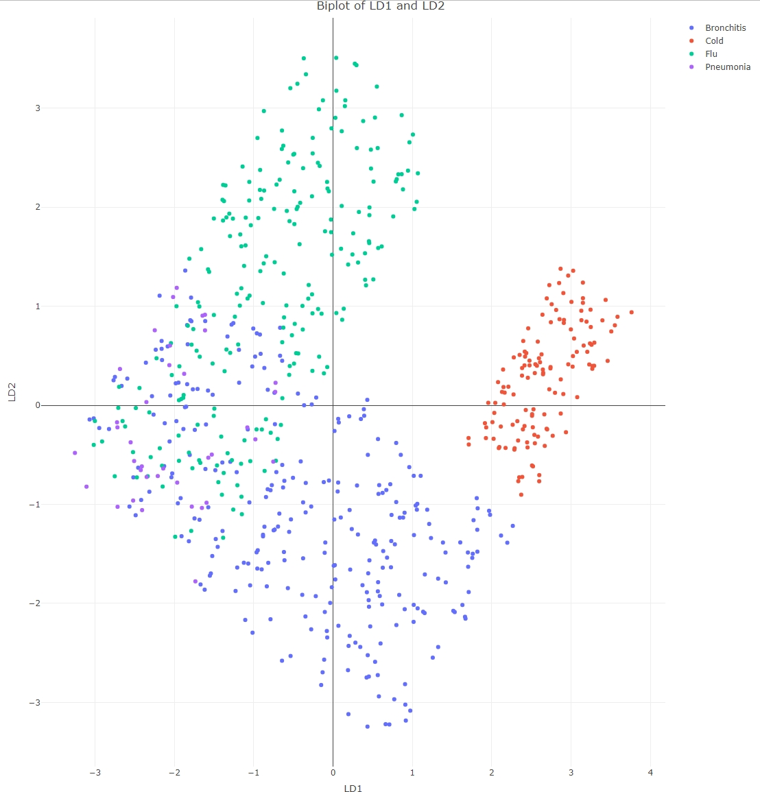

# respiratory-illness-classification-lda

## Overview

This project evaluates whether Linear Discriminant Analysis (LDA) can
classify four respiratory illnesses using basic vital signs.

Conditions classified: - Bronchitis
- Cold
- Flu
- Pneumonia

Predictors used: - Age
- Heart Rate
- Body Temperature
- Oxygen Saturation
- Systolic Blood Pressure
- Diastolic Blood Pressure

Dataset: 2,000 simulated patient records

------------------------------------------------------------------------

# Model Summary

With four diagnostic categories, LDA produced three discriminant
functions (LD1, LD2, LD3).

## Linear Discriminant Coefficients

  Predictor           LD1       LD2       LD3
  ------------------- --------- --------- ---------
  Age                 0.018     0.016     -0.0426
  Heart Rate          0.1296    -0.1806   1.0214
  Body Temperature    1.2959    0.9414    0.0176
  Oxygen Saturation   -0.8570   1.2327    0.1152
  Systolic BP         0.0570    -0.0406   -0.0964
  Diastolic BP        0.0033    -0.0603   0.0582

## Proportion of Variance Explained

  Linear Discriminant   Proportion of Trace
  --------------------- ---------------------
  LD1                   0.6308
  LD2                   0.3383
  LD3                   0.0309

The LDA model shows that **LD1 is the dominant discriminant**, clearly separating **Cold** from the other diagnostic groups. However, **Bronchitis, Flu, and Pneumonia exhibit substantial overlap**, meaning LD1 (even combined with LD2, which together explain ~96.9% of variance) is insufficient for clean separation among the more similar conditions.

------------------------------------------------------------------------

# Group Means (Standardized Predictors)

  --------------------------------------------------------------------------
  Diagnosis    Age     Heart Rate   Body Temp    O₂ Sat    Sys BP   Dia BP
  ------------ ------- ------------ ------------ --------- -------- --------
  Bronchitis   -0.03   -0.04        -0.21        -0.72     0.04     0.01

  Cold         -0.01   0.03         -1.27        1.19      -0.07    -0.02

  Flu          0.05    -0.17        0.83         0.32      0        -0.02

  Pneumonia    -0.04   1.18         0.94         -0.74     -0.10    0.09
  --------------------------------------------------------------------------

------------------------------------------------------------------------

# Assumption Checks

## Equality of Covariance (Box's M)

  Statistic    Value   df   p-value
  ------------ ------- ---- ---------
  Chi-Square   618.8   63   2.2e-16

Covariance matrices were not equal (assumption violated).

------------------------------------------------------------------------

# Training Set Performance

## Confusion Matrix

  Prediction  Reference   Bronchitis   Cold   Flu   Pneumonia
  ----------------------- ------------ ------ ----- -----------
  Bronchitis              215          0      41    11
  Cold                    6            129    0     0
  Flu                     46           0      181   8
  Pneumonia               8            0      4     18

## Overall Performance

  Metric     Value
  ---------- ------------------
  Accuracy   0.8141
  95% CI     (0.7825, 0.8429)
  p-value    2.2e-16

------------------------------------------------------------------------

# Test Set Performance

## Confusion Matrix

  Prediction  Reference   Bronchitis   Cold   Flu   Pneumonia
  ----------------------- ------------ ------ ----- -----------
  Bronchitis              43           0      12    4
  Cold                    0            34     0     0
  Flu                     9            0      53    1
  Pneumonia               7            0      1     2

## Overall Performance

  Metric     Value
  ---------- ------------------
  Accuracy   0.7952
  95% CI     (0.7257, 0.8538)
  p-value    2.2e-16

------------------------------------------------------------------------

# Conclusion

Linear Discriminant Analysis achieved approximately 80% overall
accuracy, but this headline number masks important weaknesses.

While the model performs extremely well in identifying common cold, its
ability to distinguish between bronchitis, flu, and especially pneumonia
is substantially weaker. Pneumonia sensitivity dropped to 28.6% on the
test set, which would be clinically unacceptable in real-world settings
where missed pneumonia cases can have serious consequences.

Additionally, key LDA assumptions (normality and equal covariance
matrices) were violated, meaning the model was operating outside ideal
statistical conditions. This likely contributed to instability in class
separation and reduced robustness.

Overall, while LDA provides a useful interpretable baseline, it is not
sufficiently reliable for high-stakes clinical deployment when using
vital signs alone. More advanced machine learning approaches and richer
clinical data would likely be necessary to achieve clinically safe and
operationally viable diagnostic performance.
